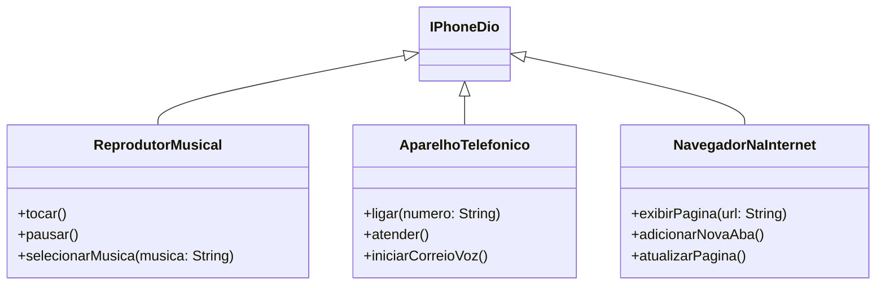

## Diagrama UML para criar as classes do IPhone-Dio.

```mermaid
classDiagram
    class IPhoneDio {
    }

    class ReprodutorMusical {
        +tocar()
        +pausar()
        +selecionarMusica(musica: String)
    }

    class AparelhoTelefonico {
        +ligar(numero: String)
        +atender()
        +iniciarCorreioVoz()
    }

    class NavegadorNaInternet {
        +exibirPagina(url: String)
        +adicionarNovaAba()
        +atualizarPagina()
    }

    IPhoneDio <|-- ReprodutorMusical
    IPhoneDio <|-- AparelhoTelefonico
    IPhoneDio <|-- NavegadorNaInternet
```
